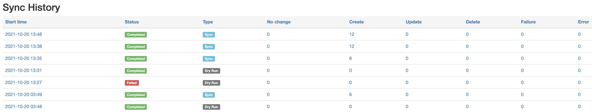

# Nautobot SSoT Plugin - IPFabric

This plugin was created to allow users to sync data from IP Fabric into Nautobot.

## Overview

Currently this plugin will provide the ability to sync the following IP Fabric models into Nautobot.

- Site -> Nautobot Site
- Device -> Nautobot Device
- Part Numbers -> Nautobot Manufacturer/Device Type/Platform
- Interfaces -> Nautobot Device Interfaces

## Installation & Configuration

The plugin is available as a Python package in pypi and can be installed with pip

```shell
pip install nautobot-ssot-ipfabric
```

> The plugin is compatible with Nautobot 1.1.0 and higher

To ensure Nautobot SSoT IPFabric is automatically re-installed during future upgrades, create a file named `local_requirements.txt` (if not already existing) in the Nautobot root directory (alongside `requirements.txt`) and list the `nautobot-ssot-ipfabric` package:

```bash
echo nautobot-ssot-ipfabric >> local_requirements.txt
```

Once installed, the plugin needs to be enabled in your `nautobot_config.py` as well as the **IP Fabric Host** and **IP Fabric API Token**.

```python
# In your nautobot_config.py
PLUGINS = ["nautobot_ssot_ipfabric"]

PLUGINS_CONFIG = {
  "nautobot_ssot_ipfabric": {
      "IPFABRIC_HOST": os.environ.get("IPFABRIC_HOST"),
      "IPFABRIC_API_TOKEN": os.environ.get("IPFABRIC_API_TOKEN"),
  }
}
```

Additional plugin configuration parameters are able to be provided to manipulate the behavior of the SSoT functionality.
The parameters below are self explanatory. Below is how the plugin accesses the values.

```bash
ALLOW_DUPLICATE_ADDRESSES = CONFIG.get("ALLOW_DUPLICATE_ADDRESSES", True)
DEFAULT_INTERFACE_TYPE = CONFIG.get("DEFAULT_INTERFACE_TYPE", "1000base-t")
DEFAULT_INTERFACE_MTU = CONFIG.get("DEFAULT_INTERFACE_MTU", 1500)
DEFAULT_INTERFACE_MAC = CONFIG.get("DEFAULT_INTERFACE_MAC", "00:00:00:00:00:01")
DEFAULT_DEVICE_ROLE = CONFIG.get("DEFAULT_DEVICE_ROLE", "Network Device")
```

To set any or all, append to the plugin configuration dictionary as followed:

```python
PLUGINS_CONFIG = {
  "nautobot_ssot_ipfabric": {
      "IPFABRIC_HOST": os.environ.get("IPFABRIC_HOST"),
      "IPFABRIC_API_TOKEN": os.environ.get("IPFABRIC_API_TOKEN"),
      "ALLOW_DUPLICATE_ADDRESSES" = os.environ.get("ALLOW_DUPLICATE_ADDRESSES"),
      "DEFAULT_INTERFACE_TYPE" = os.environ.get("DEFAULT_INTERFACE_TYPE"),
      "DEFAULT_INTERFACE_MTU" = os.environ.get("DEFAULT_INTERFACE_MTU"),
      "DEFAULT_INTERFACE_MAC" = os.environ.get("DEFAULT_INTERFACE_MAC"),
      "DEFAULT_DEVICE_ROLE" = os.environ.get("DEFAULT_DEVICE_ROLE"),
  }
}
```

## Usage

Nautobot SSoT IP Fabric provides a user interface to interact with the underlying job that executes the synchronization from **IP Fabric** into **Nautobot**.

### Single Source of Truth Dashboard

This plugin leverages the [Single Source of Truth](https://github.com/nautobot/nautobot-plugin-ssot) plugin that provides a dashboard with a fantastic entrypoint for seeing the status of the synchronization between **IP Fabric** and **Nautobot**.

You can navigate to the SSoT Dashboard with the following steps:

1. Click the **Plugins** menu and select **Dashboard** under *Single Source of Truth*.


Now you should see the dashboard with information pertaining to **IP Fabric**.


We can see **IP Fabric** under **Data Sources** with some quick information such as the results of the latest synchronizations and the ability to launch the synchronization job.

On the right hand side, we're provided with additional information such as the source, target, start time, status, and the type of job.

Let's go ahead and click on **IP Fabric** under **Data Sources**.


Now we can see additional details as to which IP Fabric host we're syncing from and the models that get get mapped between the source and destination. We can also kick off sync job by clicking on **Sync Now**, but we will revisit that shortly.

Below, the sync history is provided with more details of what happened during each synchronization job.



Now back to running the job. Let's click on **Sync Now**.


There are two options available.

- **Debug**: Enables more verbose logging that can be useful for troubleshooting synchronization issues.
- **Dry run**: This will only report the difference between the source and destination without synchronization.

If interested to see the source code, click on **Source**.

After a job is launched, you will be redirected to the job results page which will provide any logged messages during the synchronization.

If you're interested in more details, click **SSoT Sync Details**.


You can then views the details of each object.


## DiffSync Models

### IPFabric Site

| IP Fabric (Source) | DiffSync Model | Nautobot (Destination) |
| ------------------ | -------------- | ---------------------- |
| siteName           | Location.name  | Site                   |

### IPFabric Device

| IP Fabric (Source) | DiffSync Model       | Nautobot (Destination) |
| ------------------ | -------------------- | ---------------------- |
| hostname           | Device.name          | Device.name            |
| siteName           | Device.location_name | Device.site            |
| vendor             | Device.vendor        | Device.manufacturer    |
| model              | Device.model         | Device.device_type     |
| sn                 | Device.serial_number | Device.serial          |

### IPFabric Interface

| IP Fabric (Source) | DiffSync Model          | Nautobot (Destination)    |
| ------------------ | ----------------------- | ------------------------- |
| intName            | Interface.name          | Interface.name            |
| hostname           | Interface.device_name   | Interface.assigned_object |
| mac                | Interface.mac_address   | Interface.mac_address     |
| mtu                | Interface.mtu           | Interface.mtu             |
| N/A                | Interface.type          | Interface.type            |
| primaryIp          | Interface.ip_address    | IPAddress.address         |
| N/A                | Interface.subnet_mask   | IPAddress.address         |
| N/A                | Interface.ip_is_primary | Device.primary_ip         |

### IPFabric VLAN

| IP Fabric (Source) | DiffSync Model | Nautobot (Destination) |
| ------------------ | -------------- | ---------------------- |
| vlanName           | Vlan.name      | VLAN.name              |
| vlanId             | Vlan.vid       | VLAN.vid               |
| status             | Vlan.status    | VLAN.status            |
| siteName           | Vlan.site      | VLAN.site              |
