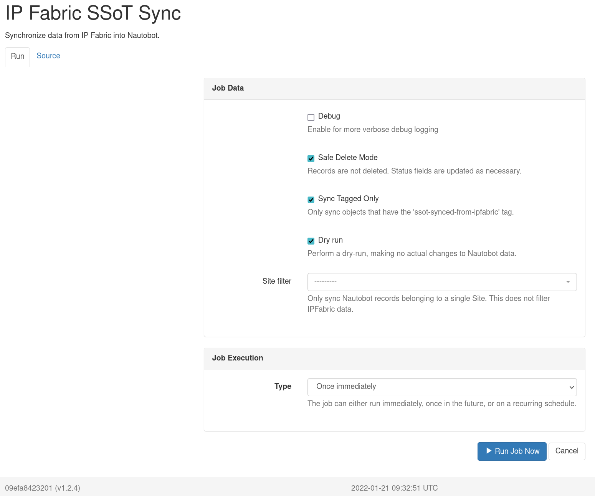

# Nautobot SSoT Plugin - IPFabric

This plugin was created to allow users to sync data from IP Fabric into Nautobot.

## Overview

Currently this plugin will provide the ability to sync the following IP Fabric models into Nautobot.

- Site -> Nautobot Site
- Device -> Nautobot Device
- Part Numbers -> Nautobot Manufacturer/Device Type/Platform
- Interfaces -> Nautobot Device Interfaces
- IPAddresses -> Nautobot IPAddresses

## Installation & Configuration

The plugin is available as a Python package in pypi and can be installed with pip

```shell
pip install nautobot-ssot-ipfabric
```

> The plugin is compatible with Nautobot 1.1.0 and higher

To ensure Nautobot SSoT IPFabric is automatically re-installed during future upgrades, create a file named `local_requirements.txt` (if not already existing) in the Nautobot root directory (alongside `requirements.txt`) and list the `nautobot-ssot-ipfabric` package:

```bash
echo nautobot-ssot-ipfabric >> local_requirements.txt
```

Once installed, the plugin needs to be enabled in your `nautobot_config.py` as well as the **IP Fabric Host** and **IP Fabric API Token**.

```python
# In your nautobot_config.py
PLUGINS = ["nautobot_ssot_ipfabric"]

PLUGINS_CONFIG = {
  "nautobot_ssot_ipfabric": {
      "ipfabric_host": os.environ.get("IPFABRIC_HOST"),
      "ipfabric_api_token": os.environ.get("IPFABRIC_API_TOKEN"),
  }
}
```

There are many additional configuration environment variables you are able to modify.
To set any or all, update the plugin configuration dictionary as followed inside of your `nautobot_config.py` configuration settings file:

```python
PLUGINS_CONFIG = {
  "nautobot_ssot_ipfabric": {
      "ipfabric_host": os.environ.get("IPFABRIC_HOST"),
      "ipfabric_api_token": os.environ.get("IPFABRIC_API_TOKEN"),
      "nautobot_host" = os.environ.get("NAUTOBOT_HOST"),
      "default_interface_type" = os.environ.get("DEFAULT_INTERFACE_TYPE"),
      "default_interface_mtu" = os.environ.get("DEFAULT_INTERFACE_MTU"),
      "default_interface_mac" = os.environ.get("DEFAULT_INTERFACE_MAC"),
      "default_device_status" = os.environ.get("DEFAULT_DEVICE_STATUS"),
      "default_device_status_color" = os.environ.get("DEFAULT_DEVICE_STATUS_COLOR"),
      "default_device_role" = os.environ.get("DEFAULT_DEVICE_ROLE"),
      "default_device_role_color" = os.environ.get("DEFAULT_DEVICE_ROLE_COLOR"),
      "safe_delete_device_status" = os.environ.get("SAFE_DELETE_DEVICE_STATUS")
      "safe_delete_site_status" = os.environ.get("SAFE_DELETE_SITE_STATUS")
      "safe_delete_ipaddress_status" = os.environ.get("SAFE_DELETE_IPADDRESS_STATUS")
      "safe_delete_vlan_status" = os.environ.get("SAFE_DELETE_VLAN_STATUS")

  }
}
```

The `nautobot_host` variable should be a FQDN of your Nautobot instance. This is used to provide a URL to the job results via Chatops and it's not required.

Here are the default values set while performing the synchronization job and importing data into Nautobot: Notice how these values are extracted from the settings of our specific application, `nautobot_ssot_ipfabric`.

```python
CONFIG = settings.PLUGINS_CONFIG.get("nautobot_ssot_ipfabric", {})

DEFAULT_INTERFACE_TYPE = CONFIG.get("default_interface_type", "1000base-t")
DEFAULT_INTERFACE_MTU = CONFIG.get("default_interface_mtu", 1500)
DEFAULT_INTERFACE_MAC = CONFIG.get("default_interface_mac", "00:00:00:00:00:01")
DEFAULT_DEVICE_ROLE = CONFIG.get("default_device_role", "Network Device")
DEFAULT_DEVICE_ROLE_COLOR = CONFIG.get("default_device_role_color", "ff0000")
DEFAULT_DEVICE_STATUS = CONFIG.get("default_device_status", "Active")
DEFAULT_DEVICE_STATUS_COLOR = CONFIG.get("default_device_status_color", "ff0000")
ALLOW_DUPLICATE_ADDRESSES = CONFIG.get("allow_duplicate_addresses", True)
NAUTOBOT_HOST = CONFIG.get("nautobot_host")
SAFE_DELETE_DEVICE_STATUS = CONFIG.get("safe_delete_device_status", "Offline")
SAFE_DELETE_SITE_STATUS = CONFIG.get("safe_delete_site_status", "Decommissioning")
SAFE_DELETE_IPADDRESS_STATUS = CONFIG.get("safe_ipaddress_interfaces_status", "Deprecated")
SAFE_DELETE_VLAN_STATUS = CONFIG.get("safe_delete_vlan_status", "Deprecated")
```

## Safe Delete Mode

By design, an SSoT Plugin using Diffsync will Create, Update or Delete when synchronizing two data sources. However, this may not always be what we want to happen with our Source of Truth (Nautobot). A job configuration option is available and enabled by default to prevent deleting objects from the database and instead, update the `Status` of said object alongside assigning a default tag, `ssot-safe-delete`. For example, if an additional snapshot is created from IPFabric, synchronized with Nautobot and, it just so happens that a device was unreachable, down for maintenance, etc., This doesn't `always` mean that our Source of Truth should delete this object, but we may need to bring attention to this matter. We let you decide what should happen. One thing to note is that some of the objects will auto recover from the changed status if a new job shows the object is present. However, currently, IPAddresses and Interfaces will not auto-update to remove the `ssot-safe-delete` tag. The user is responsible for reviewing and updating accordingly. Safe delete tagging of objects works in an idempotent way. If an object has been tagged already, the custom field defining the last update will not be updated with a new sync date from IPFabric. So, if you re-run your sync job days apart and, you'd expect the date to change but the object has been flagged as safe to delete; you will not see an updated date on the object custom field unless the status changed, in which case the tag (depending on the object) would be removed followed by updating the last date of sync.

The default status change of an object were to be `deleted` by SSoT Diffsync operations, will be specified below. These are the default transitions states, unless otherwise specified in the configuration options of the plugin by a user.

- Device -> Offline (Auto deletes tag upon recovery)
- IPAddresses -> Deprecated (Does not auto-delete tag upon recovery)
- VLAN -> Deprecated (Auto deletes tag upon recovery)
- Site -> Decommissioning (Auto deletes tag upon recovery)
- Interfaces -> Tagged with `ssot-safe-delete` (Does not auto-delete tag upon recovery)

If you would like to change the default status change value, ensure you provide a valid status name available for the referenced object. Not all objects share the same `Status`.


An example object that's been modified by SSoT App and tagged as `ssot-safe-delete` and `ssot-synced-from-ipfabric`. Notice the Status and child object, IPAddress has also changed to Deprecated and, it's status changed and tagged as well.


During job execution, a warning will be provided to show the status change of an object.


If an object has already been updated with the tag, a warning message will be displayed and the object will not be modified (including sync date).


## Usage

Nautobot SSoT IP Fabric provides a user interface to interact with the underlying job that executes the synchronization from **IP Fabric** into **Nautobot**.

### Single Source of Truth Dashboard

This plugin leverages the [Single Source of Truth](https://github.com/nautobot/nautobot-plugin-ssot) plugin that provides a dashboard with a fantastic entrypoint for seeing the status of the synchronization between **IP Fabric** and **Nautobot**.

You can navigate to the SSoT Dashboard with the following steps:

1. Click the **Plugins** menu and select **Dashboard** under *Single Source of Truth*.


Now you should see the dashboard with information pertaining to **IP Fabric**.


We can see **IP Fabric** under **Data Sources** with some quick information such as the results of the latest synchronizations and the ability to launch the synchronization job.

On the right hand side, we're provided with additional information such as the source, target, start time, status, and the type of job.

Let's go ahead and click on **IP Fabric** under **Data Sources**.


Now we can see additional details as to which IP Fabric host we're syncing from and the models that get get mapped between the source and destination. We can also kick off sync job by clicking on **Sync Now**, but we will revisit that shortly.

Below, the sync history is provided with more details of what happened during each synchronization job.


Now back to running the job. Let's click on **Sync Now**.



There are several options available.

- **Debug**: Enables more verbose logging that can be useful for troubleshooting synchronization issues.
- **Safe Delete Mode**: Delete operations changes the object status to a predefined value (configurable via settings) and tags the object with `ssot-safe-delete` tag.
- **Sync Tagged Only**: Only load Nautobot data into Diffsync adapters that's been tagged with `ssot-synced-from-ipfabric` tag.
- **Dry run**: This will only report the difference between the source and destination without synchronization.
- **Site Filter**: Filter the data loaded into Diffsync by a top level location of a specified Site.

If interested to see the source code, click on **Source**.

After a job is launched, you will be redirected to the job results page which will provide any logged messages during the synchronization.

If you're interested in more details, click **SSoT Sync Details**.


You can then views the details of each object.


Site objects include a site diagram from IPFabric, which is using the new custom field to render the appropriate site-id. Navigate to any site that's been synced by SSoT IPFabric and take a look!


## DiffSync Models

### IPFabric Site

| IP Fabric (Source) | DiffSync Model | Nautobot (Destination) |
| ------------------ | -------------- | ---------------------- |
| siteName           | Location.name  | Site                   |

### IPFabric Device

| IP Fabric (Source) | DiffSync Model       | Nautobot (Destination) |
| ------------------ | -------------------- | ---------------------- |
| hostname           | Device.name          | Device.name            |
| siteName           | Device.location_name | Device.site            |
| vendor             | Device.vendor        | Device.manufacturer    |
| model              | Device.model         | Device.device_type     |
| sn                 | Device.serial_number | Device.serial          |


### IPFabric Interface

| IP Fabric (Source) | DiffSync Model          | Nautobot (Destination)    |
| ------------------ | ----------------------- | ------------------------- |
| intName            | Interface.name          | Interface.name            |
| hostname           | Interface.device_name   | Interface.assigned_object |
| mac                | Interface.mac_address   | Interface.mac_address     |
| mtu                | Interface.mtu           | Interface.mtu             |
| N/A                | Interface.type          | Interface.type            |
| primaryIp          | Interface.ip_address    | IPAddress.address         |
| N/A                | Interface.subnet_mask   | IPAddress.address         |
| N/A                | Interface.ip_is_primary | Device.primary_ip         |

> Note: Interfaces only support synchronizing 1 IP Address at the moment.

### IPFabric VLAN

| IP Fabric (Source) | DiffSync Model | Nautobot (Destination) |
| ------------------ | -------------- | ---------------------- |
| vlanName           | Vlan.name      | VLAN.name              |
| vlanId             | Vlan.vid       | VLAN.vid               |
| status             | Vlan.status    | VLAN.status            |
| siteName           | Vlan.site      | VLAN.site              |

## Device Roles

Although IP Fabric does not have a dedicated model that corresponds to Nautobot Device Role objects, the plugin will create new Device Roles that correspond to the synced Device's `devType` attribute. The resulting Device Role object in Nautobot will have a custom field called **IPFabric Type** that maps directly to the `devType` field in IP Fabric. You can change the Device Role's name and color without any impact between syncs. However, if you change the custom field **IPFabric Type**, then on subsequent syncs a new Device Role object will be created and the Devices that have been synced from IP Fabric will revert to using the new Device Role.